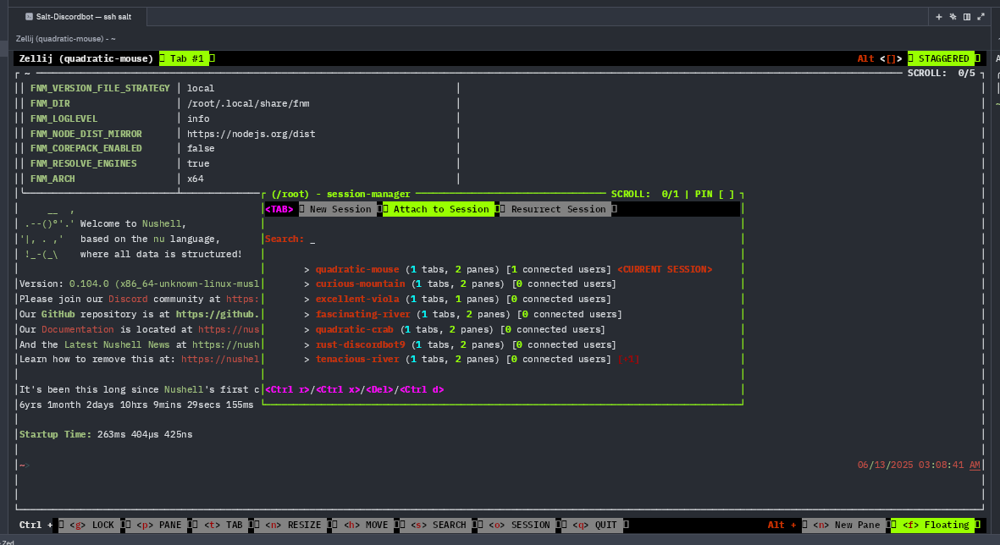

# Salt-Discordbot

## Deploy
```nushell
# Building locally
cargo build --release

# Copying binary to server however you like
# to the path /home/ah/Desktop/rust-discordbot
scp target/release/salt-discordbot salt:///home/ah/Desktop/rust-discordbot
```

## Killing previously running session
To stop the bot from running, try running the `/admin kill` discord slash command in the test server. If that doesn't kill it, you can just Ctrl+C in the running zellij session below

## Running
I currently use `zellij` because it is simple, to use run:
```nu
/home/ah/Desktop/zellij
```
Then, press Controll+O then W, which will open the session manager, which looks like this:



Then, type `rust`, which should auto-complete to a running session, e.g. `rust-discordbot9`, and click enter which will get you into the session.
If a rust-discordbotX session doesn't exist, you can press Ctrl+R (while in the session manager) to rename your current session to `rust-discordbotX`
where X is a suitably high number (you can't name duplicates, keep picking a higher number until it allows you, the error message will be
something like 'Error: A resurrectable session by this name already exists').
Then run this:
```nu
cd /home/ah/Desktop
# runs the discordbot binary
./rust-discordbot
```

After you have a running session you want to keep running in the background, **DON'T CLOSE YOUR TERMINAL**, instead press Control+O then D, which detaches
the session and will keep it running in the background. Then you can safely close your terminal session and zellij will keep running in the background.

## Private APIs
A private crate exists as a git submodule in this repo.

```nushell
git submodule init

# to update
git submodule update --remote
```
